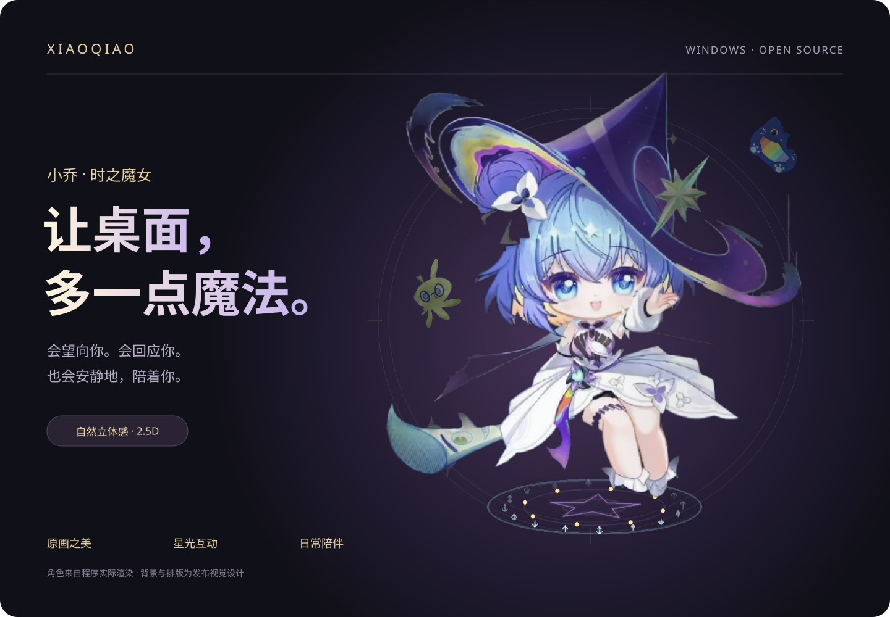
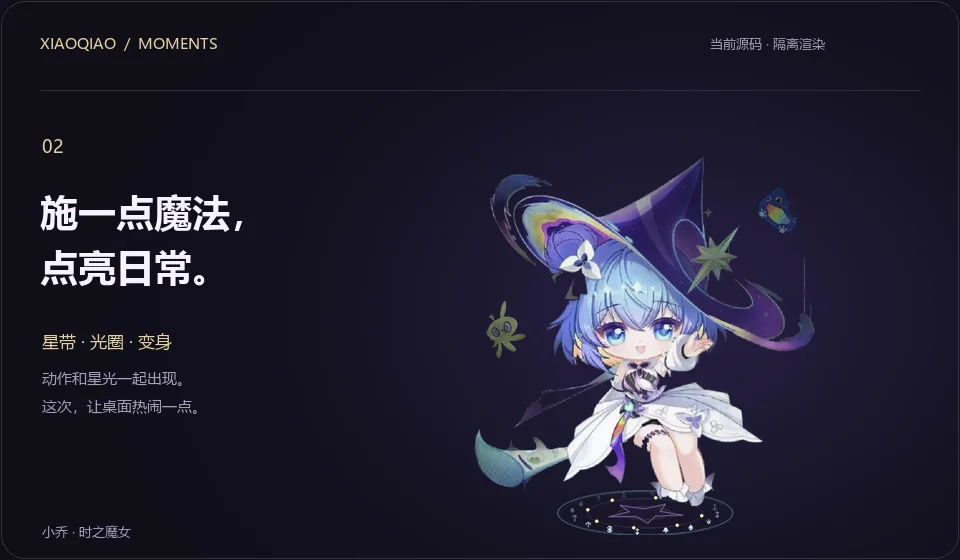
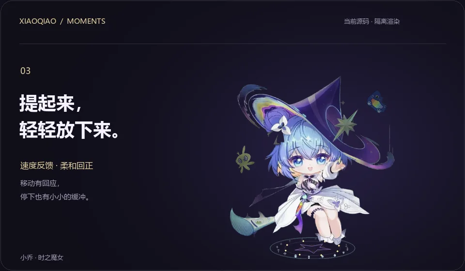

  

<strong>一位住进桌面的时之魔女。</strong> 轻轻摸头，一起接球。忙的时候，让她安静陪着你。

  <a href="docs/GUIDE.md"><strong>开始使用 ↗</strong></a> &nbsp; · &nbsp;
  <a href="https://github.com/shuai9928/xiaoqiao-desktop-pet/archive/refs/heads/main.zip">下载源码</a> &nbsp; · &nbsp;
  <a href="docs/GALLERY.md">查看静态图</a>

Windows 10 / 11 · Python 3.12–3.14 · AI 聊天可选 当前提供源码与素材，安装步骤见使用指南。

 

## 靠近，就有回应。

保留熟悉的原画，让目光、呼吸和轻轻蹭手的小动作，多一点生命感。

头部、身体、帽沿与发梢分速跟随，柔和光影带来轻微的前后层次。这是小角度 **2.5D** 演出。

 

## 把日常，点亮一点。

一圈光、一束星带，再加一支踩着节拍的舞。

时间魔法、变身、跳舞、转圈和空翻，让不同的互动有各自的动作与特效。

 

## 好玩的事，一起做。

提起来，轻轻放下。等光球弹起，点一下，和小乔一起接住它。

拖动会随速度轻倾，停住后柔和回正。光球有反弹、短拖尾，以及接住后的点头与星光回应。

 

## 右键，把陪伴展开。

<table>
<tr>
<td width="58%">
<strong>六个入口，一眼找到。</strong>  
聊天、喂糖、时间魔法、跳舞、玩球、睡觉／叫醒。  
卡片上能看到陪伴天数、星光和好感状态。更多玩法与设置，收在「更多」里。  
<strong>也陪你过平常的一天。</strong>  
番茄钟、定时提醒、小游戏，以及可选的 AI 聊天。 
无需 AI 密钥，也能使用动作、互动、语音和提醒。
</td>
<td width="42%" align="center">
 
互动卡片截图 · 展示用状态
</td>
</tr>
</table>

 

## 让小乔，住进你的桌面。

**[查看安装与使用指南 →](docs/GUIDE.md)**

准备 Windows 与 Python，安装依赖后启动。AI 需要另外配置自己的 Gemini 密钥；第一次使用可以先体验本地互动。

[完整玩法](CONTENTS.md) · [参与开发](CONTRIBUTING.md) · [自动检查](https://github.com/shuai9928/xiaoqiao-desktop-pet/actions) · [反馈问题](https://github.com/shuai9928/xiaoqiao-desktop-pet/issues)

---

演示说明：上方三个循环动画由当前公开源码在隔离环境中按固定时间步绘制；背景与标题为展示排版，并非桌面录像。互动卡片图片沿用此前隔离测试截图，窗口外观可能随版本和系统有所不同。未调用真实 AI，未使用个人聊天记录。动画不代表设备的实时帧率；不便播放时可查看 <a href="docs/GALLERY.md">静态图与演示说明</a>。

项目源码采用 <a href="LICENSE">MIT License</a>。角色立绘、贴纸、音乐与语音按 <a href="ASSET_LICENSES.md">素材授权说明</a> 单独说明，不自动适用 MIT。个人项目，非相关角色权利方的官方产品。<a href="docs/GUIDE.md#数据与隐私">数据与隐私</a>。
