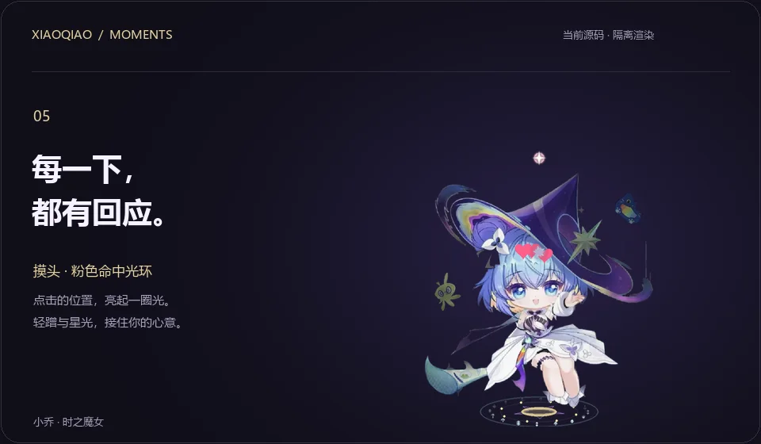
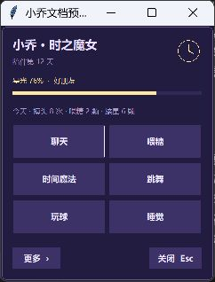
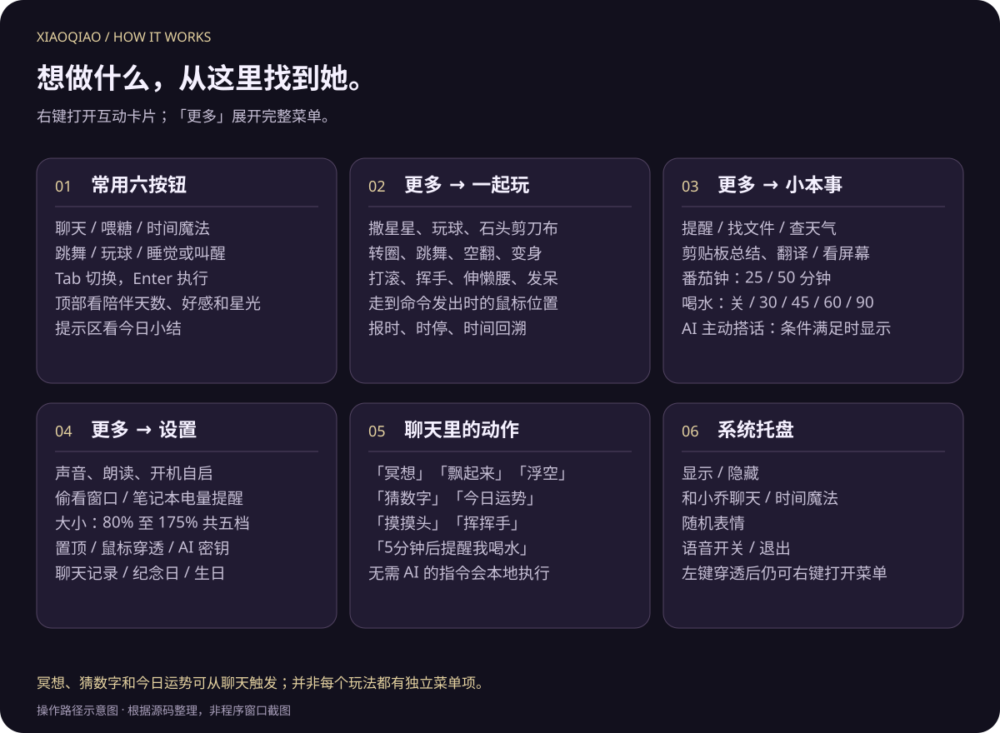
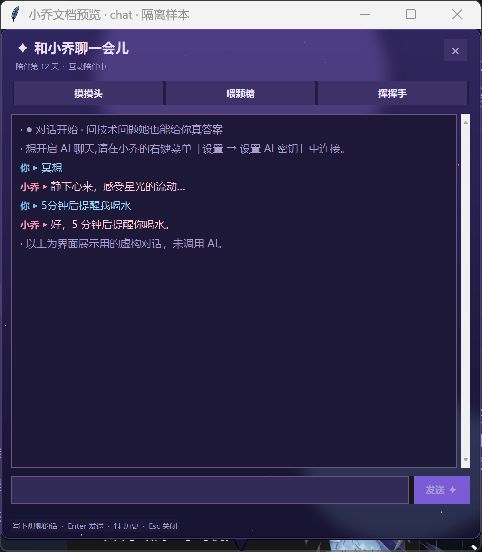
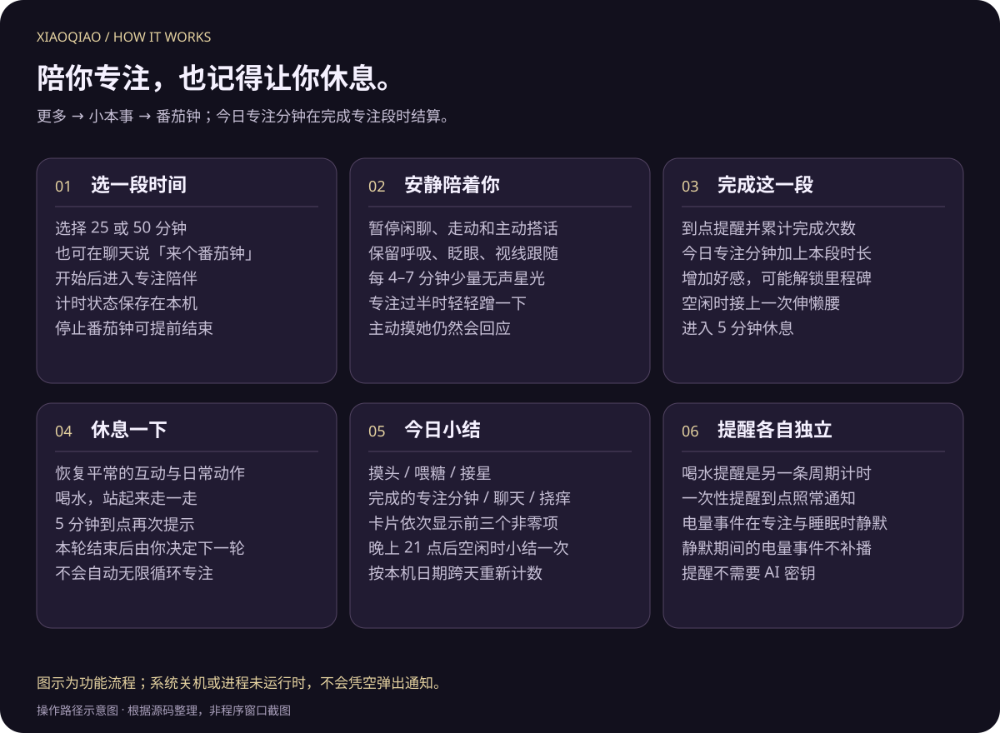

  

<strong>一位住进桌面的时之魔女。</strong> 轻轻摸头，一起接球。忙的时候，让她安静陪着你。

  <a href="docs/GUIDE.md"><strong>开始使用 ↗</strong></a> &nbsp; · &nbsp;
  <a href="https://github.com/shuai9928/xiaoqiao-desktop-pet/archive/refs/heads/main.zip">下载源码</a> &nbsp; · &nbsp;
  <a href="docs/GALLERY.md">查看静态图</a> &nbsp; · &nbsp;
  <a href="docs/README.md">文档导航</a> &nbsp; · &nbsp;
  <a href="CHANGELOG.md">更新记录</a>

Windows 10 / 11 · Python 3.12–3.14 · AI 聊天可选 当前提供源码与素材，安装步骤见使用指南。

 

## 先认识一下小乔

小乔是一款运行在 Windows 桌面上的开源宠物。她保留原有立绘，通过轻微转头、呼吸、倾斜、点头和部位跟随，让静止的原画有了细小的动作；你可以逗她玩，也可以让她陪着工作、休息和聊天。

| 你想体验什么 | 小乔能做什么 |
| --- | --- |
| 看她动起来 | 自然立体感、视线跟随、呼吸、摸头轻蹭、挠痒反馈 |
| 看不同的心情 | 18 张表情贴纸，按 20 类情绪场景选用；另有眨眼、睡眼和嘴部反馈 |
| 一起玩一会儿 | 接星星、接光球、猜拳、猜数字、今日运势，以及多种动作演出 |
| 来一点时间魔法 | 原版／全屏炫酷版魔法、时停、时间回溯、30 秒星光形态 |
| 陪你过日常 | 定时提醒、番茄钟、喝水提醒、天气、纪念日与生日彩蛋 |
| 按自己的习惯使用 | 五档大小、声音与朗读开关、窗口置顶、鼠标穿透、开机自启 |

**本地互动可以先玩起来。** 动作、表情、喂糖、小游戏与提醒不需要 AI 密钥；自由聊天、剪贴板总结／翻译和看屏幕需要连接 AI，天气需要联网。

**跟着操作：** [互动图解手册](docs/INTERACTIONS.md) · [聊天与桌面助手](docs/ASSISTANT.md) · [开发指南](docs/DEVELOPMENT.md)

**浏览这份发布介绍：** [本次新增](#whats-new) · [动作与立体感](#motion) · [18 张表情](#expressions) · [完整菜单](#menus) · [聊天与快捷互动](#chat) · [专注与陪伴](#companion) · [设置与托盘](#settings) · [开始使用](#start)

 

## 星光，有了更多回应。

这一轮，小乔多了一段浮空冥想，也会留意笔记本电量、记下今天和你做了什么。摸头、喂糖、抓取、接星和移动都有更清楚的画面反馈；打开卡片，就能看到今天留下的一点陪伴。

| 新变化 | 从哪里体验 | 看什么细节 |
| --- | --- | --- |
| 浮空冥想 | 聊天输入“冥想／飘起来／浮空”；中键也可能随机触发 | 约 5.6 秒升空、悬停与落地，三颗星核在身前身后环绕 |
| 电量感知 | 更多 → 设置 → 电量提醒 | 插拔电源、低电量与充满的回应；专注、睡眠时不打扰 |
| 今日小结 | 右键卡片的提示区 | 摸头、喂糖、接星、专注、聊天和挠痒按天计数 |
| 命中光环 | 点头部、身体、接星或开始拖拽 | 反馈出现在点击或抓取的位置 |
| 星光飘字 | 喂糖、接星、猜中奖励、插电等增加星光时 | 显示实际增加量，满格不重复飘字 |
| 会回应的法阵 | 移动鼠标靠近、观察待机与行走 | 呼吸光纹、欢迎涟漪、步伐闪光与符文变化 |

### 静下来，让星光环绕。

**试试看：右键 → 聊天 → 输入“冥想”。** 她先蓄力，再缓缓升空；近侧星核较亮，远侧星核会被原画挡住，环绕因此有了前后层次。约 5.6 秒后轻轻落地，动作自然收住。

这是本地动作，不需要 AI 密钥。当前完整菜单没有独立的冥想按钮；睡眠时会先尝试叫醒，正在进行不兼容动作时请稍后再试。[查看分段图解与操作条件 →](docs/INTERACTIONS.md#3-新动作浮空冥想)

### 每一次互动，都看得见。

- **摸头**：粉色光环从点击处亮起，接上轻蹭与回应；聊天触发时使用默认头部位置。
- **挠痒与接星**：金色光环回应命中，接星连击有错开的双圈。
- **喂糖**：弧线送糖、嘴边糖屑、轻咀嚼和满足点头连成一段动作。
- **获得星光**：头顶显示实际增加的整数值。例如接近 90 时补满只显示约 +10，已经满格不显示额外奖励。
- **移动与抓取**：落脚星尘跟着步伐出现，抓起时亮一圈，甩出后的尾迹留在飞过的路径上。
- **安静待机**：法阵随呼吸明暗变化，约每 5.2 秒荡出一道光纹；光标靠近会逐渐变亮，离开后平息。

以上新增动画使用当前源码在隔离环境渲染；背景与左侧标题属于发布排版。画面暂时隐藏随机气泡和贴纸，让动作更清楚。另有[静态关键帧](docs/GALLERY.md)。

 

## 靠近，就有回应。

保留熟悉的原画，让目光、呼吸和轻轻蹭手的小动作，多一点生命感。

头部、身体、帽沿与发梢分速跟随，柔和光影带来轻微的前后层次。这是小角度 **2.5D** 演出：能看到一点转头透视与前后层次，完整侧面和背面并不在这一版范围内。

### 直接用鼠标和她打招呼

| 操作 | 你会看到的回应 |
| --- | --- |
| 左键点头部 | 摸摸头，出现轻蹭、爱心或相关台词；关系变熟后，台词也会变化 |
| 左键点身体 | 挠痒痒，用笑意、摇摆和动作回应 |
| 双击 | 触发时间魔法，使用当前选好的魔法风格 |
| 滚轮 | 顺毛；连续互动还可能遇到害羞反应 |
| 中键 | 随机小惊喜，例如星光、跳舞、发呆或转圈 |
| 按住并拖动 | 移动她的位置；快速移动时轻微倾斜并带出星尘，停住后柔和回正 |
| 快速甩出后松手 | 可以触发飞出、下落与落地回弹，连续摇动还有摇晕反应 |
| 鼠标靠近或在身边移动 | 视线跟随、好奇反应，以及自然的小幅摆动 |
| 右键 | 打开互动卡片；按 Tab 切换按钮、Enter 执行、Esc 关闭 |

动作会和呼吸、倾斜、点头叠加。拖拽时转头幅度降低，睡着时回到中立；空翻、打滚等高速旋转过程中会暂时收起附加视差，结束后再平滑恢复。

 

## 18 张表情，把心情写在脸上。

打招呼时的雀跃、被夸奖时的得意、困了之后的晚安，还有偶尔的委屈巴巴。小乔会在互动和回复中用贴纸表达心情，让一句简单的话也有自己的语气。

以下是当前版本的 **全部 18 张表情贴纸**，直接展示仓库中的原始素材：

<table>
<tr>
<td width="33%" align="center"> <strong>你好呀</strong> 打招呼</td>
<td width="33%" align="center"> <strong>来了来了</strong> 热情回应</td>
<td width="33%" align="center"> <strong>收到</strong> 认真回应</td>
</tr>
<tr>
<td width="33%" align="center"> <strong>好的</strong> 开心答应</td>
<td width="33%" align="center"> <strong>哈哈哈</strong> 开怀大笑</td>
<td width="33%" align="center"> <strong>谢谢</strong> 感谢与亲近</td>
</tr>
<tr>
<td width="33%" align="center"> <strong>太强了</strong> 赞叹</td>
<td width="33%" align="center"> <strong>加油</strong> 鼓励与庆祝</td>
<td width="33%" align="center"> <strong>震惊</strong> 突然惊讶</td>
</tr>
<tr>
<td width="33%" align="center"> <strong>在吗</strong> 好奇探头</td>
<td width="33%" align="center"> <strong>辛苦啦</strong> 安慰陪伴</td>
<td width="33%" align="center"> <strong>摸鱼中</strong> 慵懒放松</td>
</tr>
<tr>
<td width="33%" align="center"> <strong>委屈巴巴</strong> 鼓嘴小情绪</td>
<td width="33%" align="center"> <strong>哭哭</strong> 难过落泪</td>
<td width="33%" align="center"> <strong>破防了</strong> 情绪爆发</td>
</tr>
<tr>
<td width="33%" align="center"> <strong>生气</strong> 气鼓鼓</td>
<td width="33%" align="center"> <strong>无语</strong> 一时语塞</td>
<td width="33%" align="center"> <strong>晚安</strong> 困困入睡</td>
</tr>
</table>

### 表情什么时候出现？

贴纸按 **20 类情绪场景**选取：开心、被夸奖、好奇、兴奋、感谢、疲惫、赞叹、惊讶、无语、难过、生气、慵懒、温和、睡眠、问候、告别、害羞、眩晕、跳舞和得意。不同场景可能共用贴纸，同一场景也可能随机选出不同的一张。

| 场景 | 常见的表情搭配 |
| --- | --- |
| 开心、兴奋、跳舞 | 好的、哈哈哈、来了来了、加油 |
| 被夸奖、感谢、得意 | 谢谢、太强了、加油、收到 |
| 初次招呼、好奇、温和回应 | 你好呀、来了来了、收到、在吗 |
| 累了、犯懒、准备睡觉 | 辛苦啦、摸鱼中、晚安 |
| 惊讶或被摇晕 | 震惊、太强了、破防了、无语 |
| 难过、生气、害羞或语塞 | 哭哭、委屈巴巴、破防了、生气，以及部分温和回应贴纸 |

**想主动看看表情？** 打开系统托盘里的小乔菜单，选择「随机表情」。它会从非睡眠情绪类别中随机展示；完整菜单目前没有逐张选贴纸的入口。

贴纸带有出现、切换与退场过渡，连续触发同类互动时尽量延续当前表情。除此之外，人物本身还有眨眼、睡眼、大笑／惊讶／咀嚼等局部反馈；这些五官会随人物一起变形。**18 张贴纸并不等于 18 套全身立绘或 18 个三维模型。**

 

## 把日常，点亮一点。

一圈光、一束星带，再加一支踩着节拍的舞。

时间魔法、变身、跳舞、转圈和空翻，让不同的互动有各自的动作与特效。

- **时间魔法**：可以选原版，也可以切换全屏炫酷版，并把偏好的版本设为默认。
- **魔法变身**：进入持续约 30 秒的星光形态，伴随星带和光圈演出。
- **时停**：表盘涟漪、齿轮与悬浮星光营造短暂凝滞感，随后恢复流动。
- **时间回溯**：反向旋回、紫色扫掠弧与向内收拢的时间碎屑，结束后还有晃头反馈。
- **跳舞、转圈、后空翻与打滚**：各有自己的摆动、旋转、腾空或落地节奏。
- **挥手、伸懒腰与发呆**：适合轻松一点的时刻，也能从「一起玩」里主动触发。

时停与回溯是桌宠的视觉演出，不会暂停其他软件、调整系统时间或恢复电脑文件。

 

## 好玩的事，一起做。

提起来，轻轻放下。等光球弹起，点一下，和小乔一起接住它。

拖动会随速度轻倾，停住后柔和回正。光球有反弹、短拖尾，以及接住后的点头与星光回应。

### 四种小玩法，加一点运气

| 玩法 | 怎么开始 | 怎么玩 |
| --- | --- | --- |
| 接光球 | 互动卡片「玩球」，或「一起玩 → 玩球」 | 光球出现后有 5 秒交互时间，点中即可接住；再次玩球会替换旧球，拖动或入睡会取消当前球 |
| 接星星 | 「一起玩 → 撒一把星星」，或聊天输入「撒星星」 | 点击金色星星；短时间连抓可形成连击，全接住、破纪录或快速完成都有额外反馈 |
| 石头剪刀布 | 「一起玩 → 石头剪刀布」 | 在子菜单选择石头、剪刀或布，等她倒数并揭晓结果；子菜单会显示她的胜／平／负战绩 |
| 猜数字 | 聊天输入「猜数字」 | 猜一个 1～50 的整数，她会提示方向；猜中有庆祝和星光奖励，输入「不玩了」可以结束 |
| 今日运势 | 聊天输入「今日运势」或「占卜」 | 看当天的趣味签语；节日还有专属的小变化，作为陪伴小游戏使用 |

接星星和接光球是两套不同玩法：前者强调多颗星星的连击与纪录，后者是一颗会反弹的球和一次接住反馈。

 

## 右键，把陪伴展开。

<table>
<tr>
<td width="58%">
<strong>六个入口，一眼找到。</strong>  
聊天、喂糖、时间魔法、跳舞、玩球、睡觉／叫醒。  
卡片上能看到陪伴天数、星光和好感状态。更多玩法与设置，收在「更多」里。  
<strong>也陪你过平常的一天。</strong>  
番茄钟、定时提醒、小游戏，以及可选的 AI 聊天。 
无需 AI 密钥，也能使用动作、互动、语音和提醒。
</td>
<td width="42%" align="center">
 
当前卡片 · 虚构样本；标题栏仅供预览
</td>
</tr>
</table>

 

## 从六个按钮，到完整的小世界。

这张图按入口整理功能，属于操作示意图。下方保留每个菜单项的完整说明；想跟着图片一步步体验，可打开[互动图解手册](docs/INTERACTIONS.md)。

右键打开的是一张临时互动卡片。顶部是小乔名称、陪伴天数、好感状态与星光进度；主要按钮按两列排列，常用动作不用翻菜单就能找到。

### 互动卡片：六个常用入口

| 按钮 | 点击之后 |
| --- | --- |
| 聊天 | 打开聊天窗，可输入内容，也可直接点快捷互动 |
| 喂糖 | 吃星光糖果，补充星光，并给出吃糖动作与反馈 |
| 时间魔法 | 播放当前默认风格的时间魔法 |
| 跳舞 | 开始一段跳舞演出 |
| 玩球 | 生成一颗可点击接住的光球 |
| 睡觉／叫醒 | 根据当前状态自动切换，入睡时先打哈欠，醒来后恢复互动 |

底部「更多」进入完整原菜单，「关闭」收起卡片。再次右键只保留一张卡片；失焦、选择动作或按 Esc 都会关闭。按 Tab 可以在按钮间切换，按 Enter 执行。

部分动作会根据状态暂时不可用，并显示原因：例如正在吃糖或施法、还在飞行／下落，或者她已经睡着了。先等她完成动作，或叫醒后再一起玩。

### 「更多」一级菜单

| 菜单项 | 用途 |
| --- | --- |
| 小乔名称与陪伴状态 | 展示名称、陪伴天数、星光百分比和好感等级 |
| 摸摸头 | 不用准确点到头部，也能主动触发摸头 |
| 吃星光糖果 | 喂糖补充星光 |
| 睡一觉／叫醒小乔 | 随睡醒状态变化的入口 |
| ⏳ 时间魔法 ▸ | 进入魔法风格子菜单 |
| ✦ 和小乔聊天 | 打开聊天窗口 |
| 唱首歌 ♪／停止唱歌 | 开始或停止歌曲播放，唱歌时搭配摆动和音符 |
| 一起玩 ▸ | 动作、魔法演出与小游戏 |
| 小本事 ▸ | 提醒、天气、番茄钟、找文件与 AI 辅助功能 |
| 设置 ▸ | 声音、大小、窗口行为、AI 和个人日期设置 |
| 退出 | 结束桌宠程序 |

### 时间魔法子菜单

| 选项 | 说明 |
| --- | --- |
| 原版（默认） | 使用原版时间魔法演出 |
| ✨ 全屏炫酷版 | 使用更大范围的魔法特效演出 |
| 默认使用炫酷版 | 切换默认风格，影响常用魔法入口 |

### 「一起玩」的 15 个入口

| 菜单项 | 玩法或反馈 |
| --- | --- |
| 🌟 撒一把星星（点星接住！） | 生成可捕捉的金色星星，支持连击、全接住与纪录反馈 |
| 💫 转个圈 | 转圈演出，结束后自然收势 |
| 💃 跳个舞 | 按节拍摆动，配合星光与落地反馈 |
| 🤸 后空翻 | 腾空翻转，再落地回弹 |
| ✨ 魔法变身（30s 星光形态） | 变身后短时间保持星光形态 |
| 🤪 打个滚 | 滚动与收势演出 |
| 👋 挥挥手 | 挥手打招呼，带出星光轨迹 |
| ⚽ 玩球（扔给她接！） | 一次一颗光球，点击接住 |
| 🧘 伸懒腰 | 舒展、回弹，适合休息一下 |
| 🔭 发会儿呆 | 小幅探看与发呆动作 |
| 🏃 过来我这边 | 朝发出命令时鼠标所在的位置移动，途中减速，到达后回应；拖动可以打断 |
| ⏰ 现在几点？ | 告诉你当前时间 |
| ⏳ 时停：时间，停止！ | 齿轮、表盘与星光凝滞演出 |
| ⏪ 时间回溯 | 反向旋转与时间碎屑演出 |
| 石头剪刀布 ✊ ▸ | 子菜单含「石头」「剪刀」「布」以及她的胜／平／负战绩 |

「过来我这边」是一次位置指令，最长追随约 6 秒；它不会一直追着之后移动的鼠标跑。

### 「小本事」菜单和二级选项

| 菜单项 | 具体功能 | 使用条件 |
| --- | --- | --- |
| 定个提醒… | 输入提醒内容与时间，到点提醒 | 本地功能 |
| 帮我找文件… | 按名称在常见目录中查找文件 | 本地功能，结果取决于实际文件和搜索范围 |
| 看看我的剪贴板 ✦ | 总结当前剪贴板中的文字 | 需要 AI |
| 翻译剪贴板 ✦ | 翻译复制好的文字 | 需要 AI |
| 看看我的屏幕 ✦ | 截取屏幕内容，交给模型分析和回答 | 需要支持视觉的 AI |
| 现在天气如何？ | 查询已设置城市的天气及温度 | 需要设置城市并联网，不需要 AI 密钥 |
| 番茄钟 ▸ | **专注 25 分钟 / 专注 50 分钟 / 停止番茄钟** | 本地计时 |
| 喝水提醒 ▸ | **关 / 每 30 分钟 / 每 45 分钟 / 每 60 分钟 / 每 90 分钟** | 本地计时，当前选项有标记 |
| AI 主动搭话：开／关 | 控制 AI 是否按配置主动发起对话 | AI 模块存在时显示，实际对话需要可用配置 |

剪贴板总结／翻译会把相应文字发给配置的模型服务；看屏幕会发送截图。它们与本地动作不同，使用前请确认当前内容适合发送。自由聊天的对话和相关记忆也会交给模型处理，详见 [数据与隐私](docs/GUIDE.md#数据与隐私)。

 

## 聊天窗，也是一张互动控制台。

*真实 Tk 界面，展示用对话均为虚构，未调用 AI；Windows 标题栏仅用于隔离截图预览。详细输入方法、指令示例和联网条件见[聊天与桌面助手](docs/ASSISTANT.md)。*

聊天窗沿用暗紫背景、浅色文字与金色强调。记录区、输入区和快捷互动各自分开，既能翻看对话，也能直接和小乔玩。

| 位置或操作 | 功能 |
| --- | --- |
| 顶部状态 | 显示陪伴天数，以及「聊天已连接」或「互动陪伴中」 |
| 快捷按钮 | **摸摸头 / 喂颗糖 / 挥挥手**，点击就能执行 |
| 输入框 | 写下想说的话，按 Enter 或点击「发送 ✦」发送；空白输入不会发送 |
| ↑ / ↓ | 在当前聊天窗口中翻看已发送的输入，并可返回未发送的草稿 |
| 记录区滚动条 | 查看较早的对话；翻看旧记录时，新回复不会强制把你拉到底部 |
| 记录区右键 | 小菜单包含 **复制选中内容 / 复制全部记录**；没有选中文字时前者不可用 |
| 关闭后重新打开 | 回放最近一部分聊天记录，方便继续之前的话题 |
| 拖动标题区域 | 移动聊天窗的位置 |
| Esc 或右上角 × | 关闭聊天窗 |

### 不用翻菜单，直接说给她听

新增本地动作：**“冥想”“飘起来”“浮空”**。输入任意一个即可尝试约 5.6 秒的浮空冥想，不需要 AI 密钥。

下面这些是本地直通的互动口令，不需要为它们调用 AI：

| 在聊天框输入 | 小乔会做什么 |
| --- | --- |
| 摸摸头 / 挠痒痒 | 摸头或挠痒回应 |
| 转个圈 / 跳个舞 / 后空翻 | 对应的动作演出 |
| 挥手 / 你好呀 | 挥手打招呼 |
| 打滚 / 变身 / 星光形态 | 打滚或魔法变身 |
| 唱首歌 / 唱歌 | 切换歌曲播放 |
| 撒星星 / 星星雨 / 接星星 | 开始接星星玩法 |
| 施魔法 / 时间魔法 | 播放时间魔法 |
| 睡一觉 / 去睡觉 | 准备入睡 |
| 猜数字 | 开始猜数；游戏中输入整数继续猜 |
| 不玩了 / 不猜了 | 结束猜数字 |
| 今日运势 / 占卜 | 查看当天的趣味运势 |

也可以尝试「5分钟后提醒我喝水」「帮我找个报告.pdf」这样的本机助手指令。连接 AI 后，再进一步进行自由聊天和内容理解。动作口令和自然语言理解的范围不同；复杂表达能否完成，取决于模型配置与本机环境。

 

## 陪伴，会一点点积累。

### 今天一起做了什么，她记得

右键卡片现在默认展示**今日小结**，按“摸头 → 喂糖 → 接星 → 完成专注分钟 → 聊天 → 挠痒”的顺序选取前三个非零项。鼠标悬停按钮时，提示区临时显示该按钮的使用说明；移开后回到小结。

| 你看到的内容 | 具体含义 |
| --- | --- |
| 摸头、喂糖、接星、挠痒 | 当天对应的互动计数，不是好感分数 |
| 聊天 | 当天记录的用户消息数，不等于 AI 调用次数 |
| 专注分钟 | 在专注段完成时加入本段时长；提前停止不会把零散分钟算作完成 |
| 只显示三项 | 卡片的空间限制，按固定顺序选取，不是最近三次动作 |
| 跨天重置 | 按本机日期重新计数，长期好感和陪伴天数独立保留 |

晚上 21 点后，在空闲、没有气泡、没有拖动且不处于专注时，她会尝试总结当天一次。不是 21:00 准点闹钟，也不会为了播报打断正在做的事。有变化时最多每分钟写入一次本机设置，正常退出也会保存。

### 笔记本充电，她也会充点星光

更多 → 设置 → **电量提醒：开／关**。程序约每分钟读取一次 Windows 电池状态；首次采样仅记录基线，无电池或读不到电量时不触发。

| 电量变化 | 反馈 |
| --- | --- |
| 插上电源 | 金色充能特效与回应；最多每 10 分钟奖励一次，实际至多 +5 星光 |
| 拔掉电源 | 提醒省着点用 |
| 未插电，跨过 20% 阈值 | 困倦的低电量提醒 |
| 未插电，跨过 10% 阈值 | 更急切地提醒寻找充电器 |
| 插电中充至 100% | 充满庆祝 |

**专注、睡眠和打哈欠期间静默，不事后补播。** 只提醒，不修改电源设置；动画中的插电由隔离脚本模拟，不读取真实电源状态。阈值和触发条件详见[电量图解](docs/INTERACTIONS.md#7-她会注意到笔记本的电量)。

### 星光与好感，是两种不同的进度

星光代表她当前的活力，会随程序运行逐渐消耗。吃一颗星光糖果最多补充 40 点，接星星和猜数字也有相应奖励；星光不足时她会提醒你，回到满格会小小庆祝。

好感随着互动增加，等级依次是 **点头之交 → 熟起来了 → 好朋友 → 很依赖你 → 最喜欢你**。升级时有台词、爱心和庆祝特效，部分摸头台词也会随关系变化。陪伴天数则记录相识以来的时间，能在互动卡片、菜单、聊天窗和托盘提示中看到。

### 你专注，她就安静一点

从「小本事 → 番茄钟」选择 25 或 50 分钟，开始一段专注时间。专注阶段会收起主动闲聊、走动、打喷嚏等容易打断你的行为，也不会自己睡过去；偶尔冒出少量无声星光，过半时给一个轻轻蹭你的动作。

这时摸她仍然有回应，只是台词更短。进入休息阶段后恢复日常活动，还会一起伸个懒腰。喝水提醒是另一套独立选项，可以按自己的习惯选择 30、45、60 或 90 分钟，也能随时关闭。

### 她也有自己的作息和小习惯

入睡前会先打哈欠，睡着后有睡眼与更缓慢的呼吸；叫醒后重新回到日常互动。不同时间、季节和节日也会影响部分问候与小演出，还可以设置自己的纪念日和生日。

<strong>想提前知道一点彩蛋？展开看看</strong>

- 连续摸头，有机会遇到「再摸就要融化啦」；偶尔还会因为怕痒轻轻躲开。
- 连续顺毛会害羞，按住不动一小会儿还有戳脸反应。
- 待机时可能打喷嚏、吹泡泡或冒出音符；泡泡可以点破。
- 深夜的问候更轻，夜间还有流星与许愿台词。
- 睡得久了再叫醒、很久不互动、星光不足或回到满格，都有相应反馈。
- 节日、纪念日、生日和特别的时刻，有机会碰到专属问候或庆祝。
- 接星星连击、全部接住、快速完成以及打破纪录，也藏着不同的结算反馈。

彩蛋带有时间、状态、概率或冷却条件，不保证每次立即触发。想查具体条件，可继续看 [完整内容清单](CONTENTS.md)。

 

## 大小、声音和习惯，都由你决定。

### 「设置」里的每一项

| 设置项 | 作用 |
| --- | --- |
| 语音（全部声音）：开／关 | 声音总开关，控制反应音效和聊天朗读的静音／恢复 |
| 开机自启：开／关 | 控制是否随 Windows 登录启动 |
| 开口说话：开／关 | 单独控制文字朗读；可用音色取决于本机语音环境 |
| 偷看窗口：开／关 | 根据前台窗口标题做简单场景判断，适时给出陪伴台词；与「看看我的屏幕」截图分析不同 |
| 电量提醒：开／关 | 允许或关闭笔记本插拔电源、低电量和充满反馈；专注与睡眠中不打扰 |
| 大小 ▸ | **小 80% / 中 100% / 大 125% / 加大 150% / 超大 175%** 五档 |
| 窗口置顶／取消置顶 | 决定是否尽量保持在其他窗口上方 |
| 鼠标穿透（点不到我）／关闭鼠标穿透 | 将左键操作交给下方窗口；右键、滚轮和中键仍可响应，可右键重新关闭穿透 |
| 设置 AI 密钥… | 配置自己的 AI 连接信息；具体步骤见使用指南 |
| 清空聊天记录（当前条数） | 清空本地聊天记录；没有记录时入口不可用 |
| 设置城市… | 指定天气查询使用的城市 |
| 设置纪念日…／取消纪念日 | 添加一个纪念日，设置后菜单会显示当前项目并提供取消入口 |
| 设置我的生日 | 为生日彩蛋设置日期 |

语音总开关与「开口说话」是两层控制：想保留动作音效、只关闭文字朗读，可以关闭「开口说话」；想安静使用，则关闭全部声音。朗读并不保证每台电脑都呈现相同音色。

### 系统托盘的小菜单

在 Windows 托盘找到小乔图标，除了查看陪伴状态，还可以使用这些入口：

| 托盘菜单 | 用途 |
| --- | --- |
| 显示／隐藏 | 临时收起或重新显示桌宠 |
| 和小乔聊天 ✦ | 打开聊天窗 |
| ⏳ 时间魔法！ | 直接施放当前默认魔法 |
| 随机表情 | 随机展示非睡眠类别的表情贴纸 |
| 语音：开／关 | 切换声音总开关 |
| 退出 | 结束桌宠 |

托盘需要运行依赖正常安装；如果图标被系统收进隐藏区域，可展开托盘查看。日常不想被挡住时，也可以先缩小、取消置顶或临时隐藏。

 

## 让小乔，住进你的桌面。

**[查看安装与使用指南 →](docs/GUIDE.md)**

准备 Windows 与 Python，安装依赖后启动。AI 需要另外配置自己的 Gemini 密钥；第一次使用可以先体验本地互动。

[完整玩法](CONTENTS.md) · [参与开发](CONTRIBUTING.md) · [自动检查](https://github.com/shuai9928/xiaoqiao-desktop-pet/actions) · [反馈问题](https://github.com/shuai9928/xiaoqiao-desktop-pet/issues)

---

演示说明：上方六段循环动画来自隔离环境下的源码渲染；前三段沿用此前发布媒体，新增三段展示本轮功能。背景与标题为展示排版，并非桌面录像。当前卡片和聊天窗截图使用虚构样本，Windows 标题栏仅用于截图预览；三张操作路径图为示意图。未调用真实 AI，未使用个人聊天记录。动画不代表设备的实时帧率；不便播放时可查看 <a href="docs/GALLERY.md">静态图与演示说明</a>。

项目源码采用 <a href="LICENSE">MIT License</a>。角色立绘、贴纸、音乐与语音按 <a href="ASSET_LICENSES.md">素材授权说明</a> 单独说明，不自动适用 MIT。个人项目，非相关角色权利方的官方产品。<a href="docs/GUIDE.md#数据与隐私">数据与隐私</a>。

## 想继续了解，从这里出发。

| 想了解什么 | 文档 |
| --- | --- |
| 第一次安装、启动和打包 | [安装指南](docs/GUIDE.md) |
| 每个动作怎么触发、哪里找、为什么没反应 | [互动图解手册](docs/INTERACTIONS.md) |
| 聊天快捷键、本地指令、AI 设置、数据与声音 | [聊天与桌面助手](docs/ASSISTANT.md) |
| 只看静态图片 | [静态图集](docs/GALLERY.md) |
| 这轮新增与修复 | [更新记录](CHANGELOG.md) |
| 源码地图、测试与演示生成 | [开发指南](docs/DEVELOPMENT.md) · [工具清单](tools/README.md) |
| 所有文档入口 | [文档导航](docs/README.md) |
