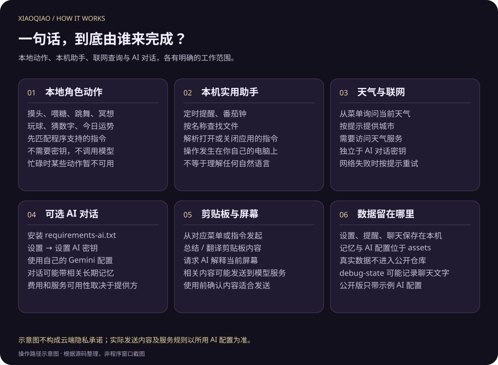

# 小乔 · 聊天与桌面助手

[← 文档导航](README.md) · [互动图解](INTERACTIONS.md) · [安装指南](GUIDE.md)

## 聊天窗里有哪些操作

右键 → **聊天**，或系统托盘 → **和小乔聊天**。即使不配置 AI，聊天窗仍是本地指令与互动的入口。

*真实 Tk 聊天控件，使用虚构对话；未向任何模型发送消息。预览标题栏仅用于截图，日常聊天窗使用程序自己的标题区域。*

| 区域 | 使用方法 |
| --- | --- |
| 标题和状态 | 查看陪伴天数与当前是否连接 AI；拖动程序标题区域移动窗口 |
| 摸摸头／喂颗糖／挥挥手 | 直接触发对应动作，不必输入一句完整的话 |
| 对话记录 | 滚动阅读；停留在旧消息时，新回复不会强行把位置拉回底部 |
| 记录区右键 | 复制选中内容，或复制全部记录 |
| 输入框 | Enter 发送；空白输入不会发送，发送按钮显示不可用 |
| ↑／↓ | 浏览本次窗口的输入历史；返回末尾可恢复尚未发送的草稿 |
| Esc／关闭 | 收起聊天窗；再次打开会回放最近记录，界面最多回放最近 60 条 |

气泡适合短句，长回复可能截断；完整文本请看聊天窗。关闭窗口不等于清空本地历史，“设置 → 清空聊天记录”才是清理入口。

## 先分清四种能力

| 类别 | 示例 | AI 密钥 | 网络 |
| --- | --- | --- | --- |
| 本地角色互动 | 冥想、喂糖、玩球、猜数字 | 不需要 | 不需要 |
| 本机助手 | 提醒、番茄钟、找文件、匹配应用 | 不需要 | 本地解析与操作不需要；目标网页或应用可能需要 |
| 天气 | 询问城市天气 | 不需要 | 需要天气服务 |
| AI 自由对话 | 自然聊天、复杂问题 | 需要配置 | 需要模型服务 |
| AI 内容理解 | 总结／翻译剪贴板、解释屏幕 | 需要配置 | 需要模型服务 |

本地指令按程序规则识别。包含歧义、否定或复杂上下文的句子不保证被当成动作执行；不匹配本地能力时，才可能进入 AI 路径。没有 AI 时，不应期待她回答任意知识问题。

## 可以直接试的句子

| 在输入框写 | 会发生什么 | 备注 |
| --- | --- | --- |
| `冥想` / `飘起来` / `浮空` | 约 5.6 秒浮空冥想 | 有忙碌状态限制 |
| `摸摸头` / `挠痒痒` | 本地触摸互动 | 非鼠标触发时使用默认光环落点 |
| `挥挥手` / `跳个舞` / `转个圈` | 对应动作 | 无需模型生成动作 |
| `变身` / `星光形态` | 变身演出 | 临时星光形态约 30 秒 |
| `猜数字` | 开始 1–50 猜数字 | 继续输入数字；“不玩了”结束 |
| `今日运势` | 娱乐运势 | 不是真实预测 |
| `5分钟后提醒我喝水` | 创建一次性提醒 | 句子中包含时长和事项 |
| `半小时后提醒我开会` | 按 30 分钟设置提醒 | 不是日历会议邀请 |
| `来个番茄钟` | 启动默认番茄钟 | 也可从菜单明确选择 25／50 分钟 |
| `帮我找个报告.pdf` | 按文件名称查找 | 不等于搜索文件全文 |
| `帮我打开微信` | 在本机应用索引中匹配 | 需要电脑上已有对应程序 |
| `关闭QQ` | 请求关闭匹配程序 | 使用前自行确认该程序内的工作已经保存 |
| `翻译剪贴板` | 请求翻译当前剪贴板 | 需要 AI；先确认剪贴板内容适合发送 |
| `总结一下剪贴板` | 请求总结当前剪贴板 | 同上 |

“提醒我喝水”没有给出时长，不是完整的本地定时指令。“番茄钟有什么用”是提问，不应被当作启动计时的命令。更完整的动作列表见[首页指令表](../README.md#chat)。

## 配置 AI 的步骤

1. 先按[安装指南](GUIDE.md)建立虚拟环境、安装运行依赖并启动桌宠。
2. 在同一个虚拟环境安装 `requirements-ai.txt`。
3. 右键 → 更多 → 设置 → **设置 AI 密钥…**，填入自己的 Gemini 密钥并按界面提示启用。
4. 回到聊天窗发一条普通问题，检查是否收到回复。失败时先检查网络、密钥、模型配置和服务配额。

默认运行可以没有 AI。SDK 采用延迟加载，并在适当时机后台预热；首次访问模型可能比本地动作慢。模型名与其他配置使用本机 `assets/ai_config.json`，示例文件是 [ai_config.example.json](../assets/ai_config.example.json)。费用与配额由你使用的服务决定。

Windows 上保存密钥使用 DPAPI 保护；加密配置通常不能直接换一台电脑继续使用，迁移后可重新设置自己的密钥。不要把真实配置文件提交到 GitHub。

## 记忆、主动搭话与偷看窗口

**长期记忆**用于在相关话题里提供上下文，与聊天窗的逐条记录不同。程序会从支持的自然表达中提取部分信息，再在相关对话中检索；它并不承诺记住所有内容，也不应当用来保管重要资料。

**AI 主动搭话**在“更多 → 小本事”中按条件显示，可开关。专注期间抑制主动搭话，避免计时中途被打断。

**偷看窗口**是设置中的另一项开关，用于根据前台应用类别做陪伴回应；**看看我的屏幕**是用户请求 AI 理解画面的入口。两者名称相近，但并非同一个操作，开启一个不等于已经执行另一个。

## 数据保存在什么位置

| 文件或目录 | 内容 | 是否应该上传公开仓库 |
| --- | --- | --- |
| `pet_settings.json` | 大小、声音、好感、统计、番茄钟等本机状态 | 否 |
| `pet_reminders.json` | 提醒事项与到期时间 | 否 |
| `chat_history.json` | 聊天记录 | 否 |
| `assets/memories.json` | 长期记忆 | 否 |
| `assets/ai_config.json` | 实际 AI 配置及密钥相关数据 | 否 |
| `_tts_cache/` | 合成语音缓存 | 否 |
| `pet_cmd.json` | 外部指令投递文件 | 否 |
| `pet_state.json` | 开启 `--debug-state` 后的调试状态，可能含聊天文字 | 否 |
| `pet_error.log` | 故障日志 | 否；反馈问题时先脱敏 |

这些是程序运行后在本机生成的数据，不是仓库缺失的必需下载文件。仓库的 `.gitignore` 和发布检查会排除它们；只有无密钥的配置示例可以公开。

AI 开启后，当前对话及相关记忆可能发送给配置的服务；执行剪贴板或屏幕理解时，相应内容也可能发送。不要把“本机保存历史”理解为“AI 请求永远不出电脑”。

## 声音为什么有两个开关

**语音（全部声音）**是总开关；**开口说话**控制回复朗读。关掉总开关后，即使朗读开关仍显示开启，也不会继续播放这一路声音。角色音效、歌曲和朗读的来源与播放条件不同；朗读优先尝试 Edge TTS，失败时可回退到系统 SAPI，实际可用性取决于环境。

如果只能看到文字，先确认总声音、朗读设置和 Windows 音量。基础运行依赖不保证每台电脑都有相同的联网语音环境。
