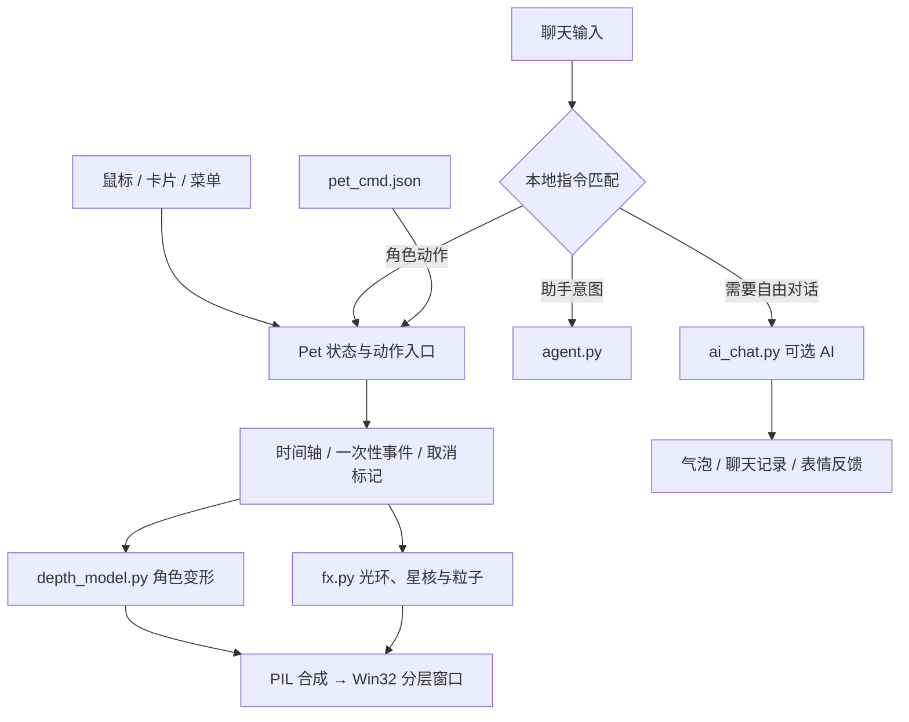

# 小乔 · 开发与维护

[← 文档导航](README.md) · [贡献约定](../CONTRIBUTING.md) · [更新记录](../CHANGELOG.md)

## 仓库怎么读

运行入口和现有模块保持在根目录，兼容 `python pet.py`、PyInstaller 与已有外部指令入口。使用文档集中在 `docs/`，发布与验证工具集中在 `tools/`；测试入口统一通过隔离运行器执行。

```text
xiaoqiao-desktop-pet/
├─ pet.py                  窗口、Pet 状态机、互动卡片、聊天窗、声音
├─ fx.py                   特效精灵、光环、星核、字形和粒子缓存
├─ depth_model.py          2.5D 深度网格、姿态跟随、光照与阴影
├─ ai_chat.py              可选 AI、记忆、配置与回复解析
├─ agent.py                本机意图解析和助手操作
├─ zcode_notify.py         可选 ZCode 通知联动
├─ build_release.py        Windows 打包与发布副本净化
├─ test_*.py               单元、模拟 UI、核心集成与助手检查
├─ assets/                 公开分发素材和无密钥配置示例
├─ docs/                   安装、互动图解、AI、开发与静态图集
│  └─ media/               README/文档使用的图片、动画和 SVG
├─ tools/                  隔离测试、公开文件检查、文档检查、演示生成
├─ .github/workflows/      Windows 持续检查
├─ README.md               产品展示与完整菜单
├─ CHANGELOG.md            可公开的版本变化
├─ CONTENTS.md             内容与彩蛋规格
└─ EXPERIMENTS.md           既有实验记录（历史记录，不是当前性能承诺）
```

### 一次互动经过哪些层



角色动作、界面与渲染主要还在 `pet.py`，并未在这次文档整理中大规模拆分引擎。这样可以避免为目录美观引入行为变化；后续拆分应有单独的迁移和回归验证。

## 按目的找源码

| 想修改 | 先看 |
| --- | --- |
| 卡片按钮、忙碌提示、今日小结 | `pet.py` 的 `InteractionCard`、`_today_summary()` |
| 完整菜单与动态开关 | `Pet._build_menu()`、`start_tray()` |
| 新动作和中途打断 | `start_*()`、`_begin_tl()`、`_play_timeline()`、`_tick_body()` |
| 电量感知 | `_power_status()`、`_battery_event()`、`_battery_tick()` |
| 互动奖励 | `gain_star()`；不要绕过它直接增加星光，否则缺少飘字反馈 |
| 光环、法阵、冥想星核 | `fx.FX`、`_draw_meditate_orbs()`、`render()` |
| 2.5D 变形与缓存 | `DepthWarp`、`DepthMotion`；同一姿态变形需覆盖五官 |
| 聊天 UI 与记录滚动 | `ChatBox` |
| 支持哪些本地短句 | `Pet.PET_ACTIONS` 与 `agent.parse()` |
| 密钥和记忆写入 | `ai_chat.py` 的配置类、`_atomic_dump()` |

## 安装开发环境

按[安装指南](GUIDE.md)创建 `.venv`。以下命令中的 `python` 指已经激活的该虚拟环境解释器；也可以替换为 `.\.venv\Scripts\python.exe`。

```powershell
python -m pip install -r requirements.txt
python tools/run_checks.py --unit-only
python tools/run_checks.py
python tools/check_docs.py
python tools/check_public_files.py
```

`run_checks.py` 把所需代码与公开素材复制到临时目录，关闭 AI、去掉模型密钥环境变量、使用虚构设置。完整模式会短暂创建测试窗口并在结束后关闭。不要直接在日常运行目录执行 `test_pet.py`。

### 哪些检查覆盖什么

| 文件 | 覆盖重点 |
| --- | --- |
| `test_action_fx.py` | 动作时间、跳跃、落地、特效衰减、冥想星核、帧率差异 |
| `test_micro_motion.py` | 靠近、轻蹭、挠痒等短互动 |
| `test_refinement.py` | 拖拽速度、追随、光球窗口与打断 |
| `test_chat_ui.py` | 真实 Tk 控件、卡片焦点／键盘、动态状态、聊天滚动 |
| `test_focus.py` | 专注期间抑制打扰、轻反馈及帧率档 |
| `test_feedback.py` | 表情与互动反馈 |
| `test_recovery.py` | 打断与姿态恢复 |
| `test_depth.py` | 网格、姿态边界、透明度和缓存 |
| `test_agent.py` | 25 条意图样例、提醒解析、临时应用索引，不启动真实软件 |
| `test_pet.py` | 完整角色集成、计数、电量、数据写入、命令与新特效等 |

2026-09-17 此次本地隔离运行：**106 项单元／UI 检查 + 9 项助手检查 + 137 项核心检查通过**。助手检查中的意图覆盖另含 25 条句子；不要把它们重复加进总数。检查数量会随代码演进变化，以实际输出为准。

### 修改动画时的约定

- 用经过时间算动作，不用“每帧移动多少”；积分需要小步长或合理夹紧。
- 一次性落地、糖屑和奖励事件必须去重；长帧不能重放大量过期特效。
- 新互动取消旧回调，拖动和睡眠能清理不兼容的球与姿态。
- 新增精灵和变形缓存必须有上限，缩放后要更新依赖尺寸的缓存。
- 需要安静待机时，别让环境粒子无意触发持续高帧率。
- UI 要覆盖键盘、小屏、多显示器负坐标、80%–175% 角色缩放。

## 图文演示如何复现

```powershell
python tools/render_showcase.py --new-only
python tools/render_guides.py
python tools/preview_ui.py --view card
python tools/preview_ui.py --view chat
```

前两项生成媒体文件；后两项打开隔离样本窗口，供手动截图，约三分钟后自动关闭。`render_showcase.py` 不带参数会生成全部六段动画及主视觉。所有脚本的用途与影响见[工具说明](../tools/README.md)。

真实界面截图保留样本容器标题栏，正文说明与日常窗口的区别。新增图要提供中文替代文字；动画必须有 PNG 静态备选。操作示意图要明确标注“非程序截图”。

## 提交与发布

1. 修改源码时同步更新菜单、交互手册和 `CHANGELOG.md`；不要把尚未实现的设计稿写成已完成功能。
2. 按改动运行隔离检查；UI 或视觉改动生成并检查实际图像。
3. `git diff --check` 检查格式；`check_docs.py` 检查本地链接、显式锚点与媒体引用。
4. 先审阅待提交文件，再暂存明确需要公开的文件；运行 `check_public_files.py` 检查 Git 跟踪内容。
5. 提交到公开仓库，确认 Windows checks 通过。打包另按安装指南操作。

不要从日常开发目录整包复制 `.git`、聊天、记忆、配置、调试日志、桌面截图或下载缓存。运行数据与公开代码分别保管；演示素材来自隔离样本。
