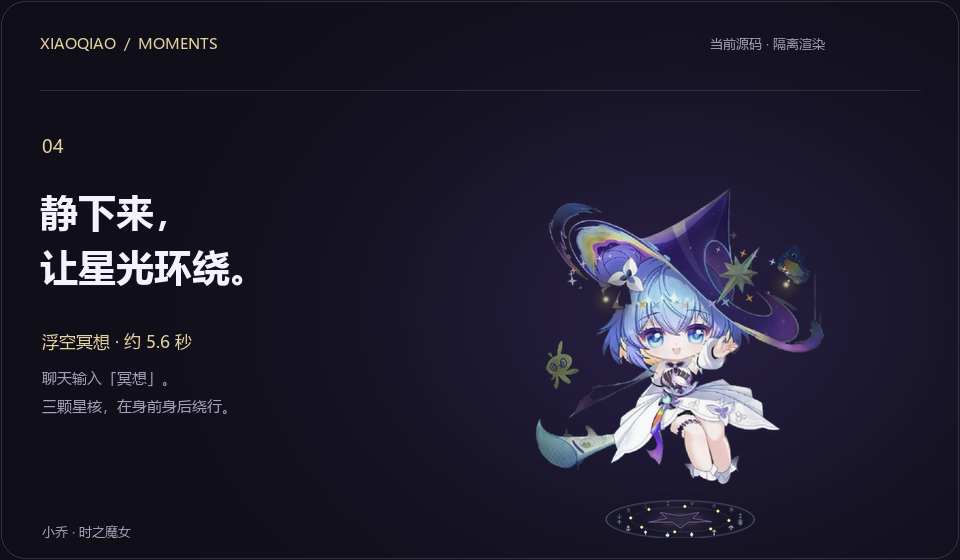
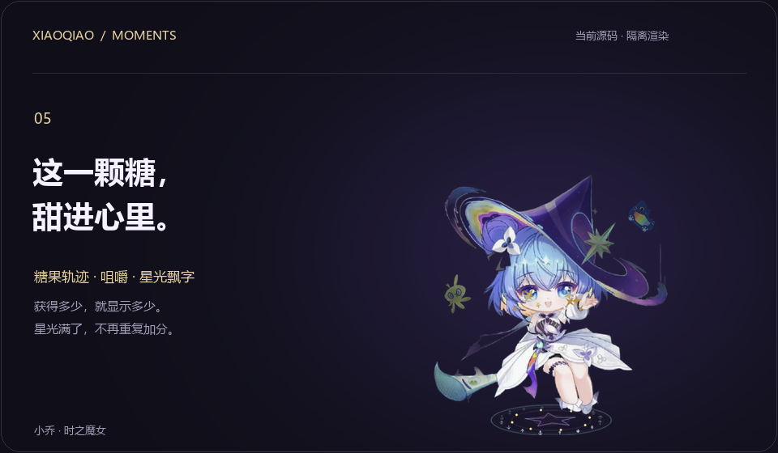

# 小乔 · 静态展示

[← 返回产品展示](../README.md) · [安装与使用](GUIDE.md)

此页仅含静态图，不会自动播放动画。

## 靠近，就有回应


保留原画的小角度 2.5D 透视、部位跟随、柔光与呼吸；摸头可触发轻蹭反馈。

## 把日常点亮一点


实际变身动作的关键帧。主页动画随后展示跳舞节选。

## 好玩的事，一起做


拖拽按移动速度反馈、停住回正；主页后半段展示光球反弹与点击接住。

## 浮空冥想



聊天输入“冥想／飘起来／浮空”可尝试这段约 5.6 秒的动作。星核有远近遮挡，动作结束后回落。

## 点击与喂糖反馈



动作演示前半段是摸头光环，后半段是喂糖。星光奖励飘字显示实际增加量，并受满格上限限制。

## 插电充能


使用模拟插电事件；不读取或修改真实硬件电源状态。电量提醒的采样、阈值和静默条件见[互动手册](INTERACTIONS.md)。

## 互动卡片


当前真实 Tk 控件截图，天数、星光和统计为虚构样本。Windows 标题栏来自截图用预览容器，正式卡片没有该标题栏。

## 聊天窗


虚构对话展示；没有调用真实 AI。界面操作、快捷键和本地指令见[聊天助手说明](ASSISTANT.md)。

## 操作路径图


以上三图是根据源码整理的功能示意图，不是软件界面截图。SVG 源码可编辑，配套脚本是 `tools/render_guides.py`。

## 演示来源

- 六段动画由本仓库 `pet.py`、`fx.py` 与 `depth_model.py` 的实际绘制逻辑生成，鼠标与时间由脚本控制；背景、标题与点击提示属于发布排版。前三段沿用此前发布媒体，后三段展示本轮新增功能。
- 使用临时副本，关闭真实 AI、声音播放及外部指令轮询，不读取日常聊天和存档。
- 20 帧/秒离线输出，不构成实际运行帧率承诺。部分文字气泡和随机表情被隐藏，以便观察动作。
- 主视觉中央人物同样来自程序渲染；背景时钟纹样为发布设计，不是桌面内新增特效。
- 动画为 WebP 格式，另备本页 PNG 静态关键帧。

在 Windows 上安装运行依赖后，可重新生成主视觉和六段动画：

```powershell
python tools/render_showcase.py
python tools/render_guides.py
```

生成脚本放在 [tools/render_showcase.py](../tools/render_showcase.py)，输出位于 `docs/media/`。所含角色形象依照 [素材授权说明](../ASSET_LICENSES.md) 使用。
