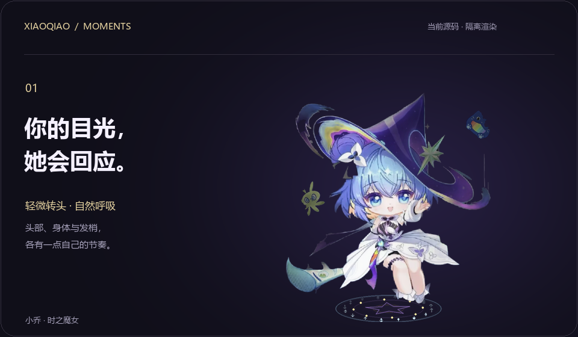
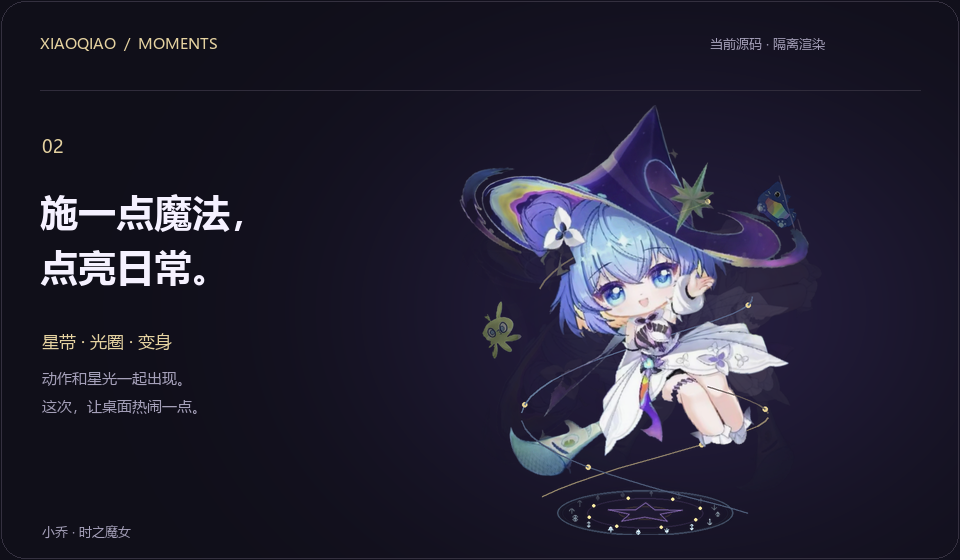
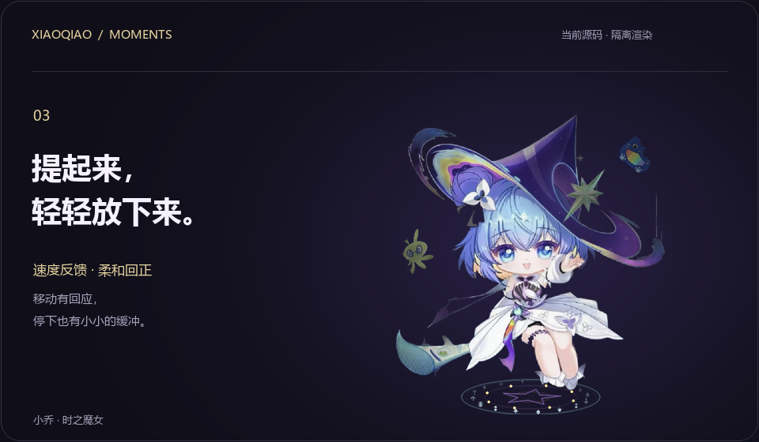
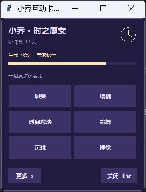

# 小乔 · 静态展示

[← 返回产品展示](../README.md) · [安装与使用](GUIDE.md)

此页仅含静态图，不会自动播放动画。

## 靠近，就有回应



保留原画的小角度 2.5D 透视、部位跟随、柔光与呼吸；摸头可触发轻蹭反馈。

## 把日常点亮一点



实际变身动作的关键帧。主页动画随后展示跳舞节选。

## 好玩的事，一起做



拖拽按移动速度反馈、停住回正；主页后半段展示光球反弹与点击接住。

## 互动卡片



沿用此前隔离测试截图，天数与星光为展示状态；当前窗口细节可能因系统和版本而不同。

## 演示来源

- 三段动画由本仓库 `pet.py` 与 `depth_model.py` 的实际绘制逻辑生成，鼠标与时间由脚本控制；背景、标题与点击提示属于发布排版。
- 使用临时副本，关闭真实 AI、声音播放及外部指令轮询，不读取日常聊天和存档。
- 20 帧/秒离线输出，不构成实际运行帧率承诺。部分文字气泡和随机表情被隐藏，以便观察动作。
- 主视觉中央人物同样来自程序渲染；背景时钟纹样为发布设计，不是桌面内新增特效。
- 动画为 WebP 格式，另备本页 PNG 静态关键帧。

在 Windows 上安装运行依赖后，可重新生成主视觉和三段动画：

```powershell
python tools/render_showcase.py
```

生成脚本放在 [tools/render_showcase.py](../tools/render_showcase.py)，输出位于 `docs/media/`。所含角色形象依照 [素材授权说明](../ASSET_LICENSES.md) 使用。
