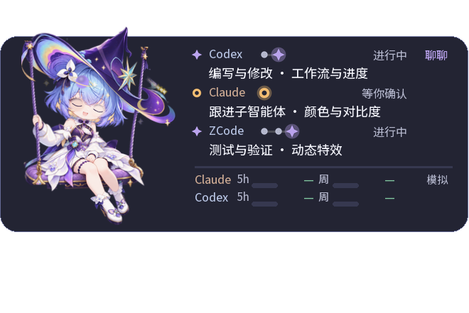

# ZCode 最新桌宠 → Claude 云端交接

日期：2026-10-06（中国标准时间）。仓库：shuai9928/xiaoqiao-desktop-pet。
接手分支：codex/zcode-desktop-pet-20261006。

## 2026-10-06 当前桌面回传（最新，覆盖下方旧交接状态）

桌面源版本：`5102d759a50dd8a90cd8d9f0b6f68926fa9aca01`；GitHub 基底：`1cac25c6e54a5c9a71dc9abc746711520f64621d`。
当前根目录已包含云端 I-31 实时视图，不再需要重复迁入它。用户本次要求把最新桌面改动回传到这个分支。

- I-32：Windows 原生 Codex/本地 Claude 会话采集；不冒充 Claude 云端实时状态。
- I-33：休息闭眼共用单条睫毛线，沿原画头部倾斜，移除重复眼线。
- I-34/I-38：工作流用阶段加有限任务方向，例如“编写与修改 · 工作流与进度”“委派子智能体 · 颜色与对比度”。展开查看不同分工，进度点仍按阶段；不列文件命令，不推测代理完成。公共hook与原生采集共用 task_directions。
- I-35：聊天、右键卡片、完整菜单/子菜单共用主界面232/255半透明材质；当前是着色alpha，无实时背景模糊，不对主人物设置全窗alpha。
- I-36/I-37：思考烟顶星唯一化、烟柱连续化，以及秋千打盹安静档。运行时不做blur；CPU收益没有本次重新量化。

本机已实际运行以上代码；源码、隔离测试和治理记录直接在根目录。最新约束见 DESIGN_CONSTITUTION.md 与 DESIGN_MEMORY.md M56。
`SOURCE_SNAPSHOT.json`列出发布源与清理项。保留现有云端历史、CI、依赖清单与旧handoff；个人记忆、会话、设置、额度快照未回传。
原生窗口和菜单效果仍须 Windows 验证，Linux/云端不得把平台导入限制当作桌面验收。

下面是本机生产渲染路径的**模拟分工示例**（页脚明确“模拟”，不是 Claude 云端真实会话或账户数据）：

该图只用于说明工作流粒度，不是未来任务计划。真实三Agent是否出现分工取决于是否取得公开委派记录。

本次发布副本检查见 VALIDATION.md 最新补充。下方是历史交接，若与此段冲突，以本段和最新治理文档为准。

## 版本与开发入口

根目录是 ZCode 本机最新实装快照，来源提交 **d9abf10d20f6fc831832b7b8323ab5cd990c938b**。
包括工作台与陪伴规则接入 I-26～28、帽上反馈 A1/A2（I-29）和中等浓度 B1～B5（I-30）。
直接修改根目录 pet.py、fx.py、hat_fx.py、flat_workspace.py 等生产模块，并同步相关测试。
不要只在 handoff/ 下另写一套示范代码，再把它称为已经接入桌宠。

本分支从已有云端分支 claude/six-row-workflow-handoff 的
**9ed04b7fcdeeec332b102e361d3fb11414cd4893** 创建，保留它的完整提交历史和 handoff/six-row-workflow/。
ZCode 本机只明确记录整合了云端 **1c88b82** 及其前序版本；后续云端 **c398bdc、9ed04b7**
仍保留在旧 handoff 目录，不能认为其“一 Agent 一行、指向下一步、去面板气泡”已自动接入根目录。
若用户要继续这些 UI 改动，请逐项迁入根目录，并保留已经上线的帽上特效与本机适配。
main 和已有 Claude 分支在此次交接中均未更新。

## 先读

根目录 AGENTS.md、DESIGN_CONSTITUTION.md、DESIGN_ISSUES.md、DESIGN_MEMORY.md、
DESIGN_ITERATIONS.md、EXPERIMENTS.md、CONTENTS.md。
历史记录包含相互覆盖的设计方向；按文档中的日期和用户最新要求确定现行约束。
README 的一些场景说明仍属于历史版本，不能据此退回旧工作室或大屋方案。

## B 系列实现与边界

- B1：金→暖白→紫的星轨渐变光带。
- B2：暖白内核、紫晕和顶金星的思考星烟。
- B3：肩线萤火与远侧帽檐符文微光。
- B4：思考开始/结束时的帽尖星爆。
- B5：完成后的薄荷绿环爆。
- fx.py 中 HatFX2 原位升级已有 hat_fx 实例；素材来自 assets/hat_fx_v1/。
- 预烘焙素材与光晕；运行时不增加高斯模糊。新增效果通过 gain_star 的 hat_fx 分支接入。
- 保留粒子上限 64、缺素材降级、减少动画、低性能降档，以及人物/脸部无遮挡约束。
- ZCode 记录的遗留 P3：偶发顶端双星、烟柱静帧略有串珠；尚未在此次交接中修复。

## 预览与证据

[evidence/design_spec.md](evidence/design_spec.md) 是 ZCode 设计规格；
[evidence/compare2.md](evidence/compare2.md) 是修复轮测量记录。
下面是 ZCode after2 的**离线合成帧**，不是本次新拍的桌面或云端真机截图：

记录中的 0.23～0.93 ms 特效增量、严格金占比等是此前 ZCode 的测量结果，
本次上传没有重新测性能或复审视觉。完整 outputs/ 与真实会话截图未上传。
复现工具：tools/fx2_harness.py（offline / measure / live）；live 需要 Windows 主实例和 --debug-state。

## 本次发布检查

在独立 Windows 发布副本运行，未改动正在使用的 ZCode 目录或桌宠进程：
- py -X utf8 test_pet.py：177/177 断言通过。
- py -X utf8 -m unittest test_life test_swing test_session_lights test_ai_lights_data test_hat_fx test_action_fx test_core_profile -q：
  运行 192 项，OK，2 项既有跳过。
- 发布检查零发现；旧 CI 测试 test_recovery 出现 30 != 20（新增 mint 后仍按两种配色计数）。详情见同目录 VALIDATION.md。
- 未宣称全量所有测试通过。此前全量中的 test_core_runtime 额度连接断言失败需要独立复核；
  不要访问真实账户、读取个人会话或消耗 AI 额度来把测试“跑绿”。

Windows 运行：安装 Python 3.14、pip install -r requirements.txt，然后 python pet.py。
AI 与打包依赖分别见 requirements-ai.txt、requirements-build.txt。
Linux 云端不能据 Windows ctypes/Tk 主程序的导入失败宣称实现失效，也不能声称已完成真实桌面验收；
纯逻辑可测部分与 Windows 原生验证分开报告，提交可供 Windows 复测的测试与预览命令。

## 发布副本与本机差异

- 排除 assets/memories.json、ai_config.json、会话、额度快照、设置、日志和缓存。
- 保留 GitHub 原有许可证、依赖清单、CI、文档和云端交接目录。
- 文档中的 Windows 用户目录匿名化；几个开发脚本和 Godot 查找改用用户主目录/脚本目录。
- 发布检查兼容 GB18030 的原有启动批处理；测试中的 AWS 示例和 Stripe 形状的顺序字母假密钥改为运行时生成的 X 占位值，避免公开仓库密钥扫描误报；实际被 GitHub 拦截的是后者。原测试的脱敏断言仍保留并重跑通过。
- 隔离测试复制全部根目录 Python 模块，以支持新版拆分后的依赖。
- 修复历史文档相对链接，README 增加新版入口。未改桌宠特效逻辑。

后续成果请提交 GitHub 分支，写清修改文件、实际运行的检查、未完成的 Windows 验证及预览位置。
用户尚未指定下一轮具体功能，本交接不把历史建议当成新的开发命令。

## 后续更新（2026-10-06，云端）

云端 c398bdc、9ed04b7 的“一 Agent 一行、当前步骤 → 下一步、去面板气泡”已迁入根目录
flat_workspace.py 与 test_flat_workspace.py（I-31）；上文“未自动接入”的说法到此为止。
LIVE_H=184、PET_TOP=15、hat_fx_pad 与帽上特效均保留。预览：
[evidence/live-view-port-preview.png](evidence/live-view-port-preview.png)（模拟数据，非真机截图）。
Linux 云端只能跑桩化的 test_flat_workspace（42 项通过，3 项需要真实 Pet）；Windows 真机验收与规定
回归套件仍待在本机执行，结论为 INCONCLUSIVE。下一步文字仅来自 session['next']，宿主未提供时显示“…”。
