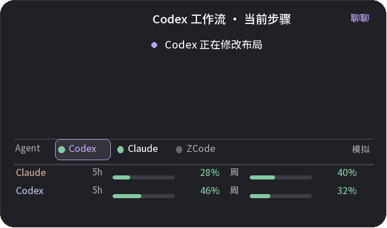
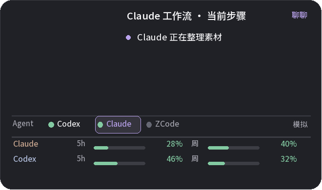

# 桌宠与工作台图像素材索引

包含本机项目中的 48 张现有图像，以及 6 张工作台截图与模拟预览。项目素材保留了原有相对目录。

## Codex / Claude 选中态

以下两张由模拟会话生成，不含真实额度样本。

## 其它工作台预览

- [半高工作台模拟](../images/previews/half-height-mock.png)
- [半高工作台实际运行](../images/previews/half-height-live.png)
- [六行工作台模拟](../images/previews/six-row-mock.png)
- [六行工作台实际运行](../images/previews/six-row-live.png)

## 项目现有图像清单

- [_zoom_surprised_1790842845.png](../images/project/diagnostics/_zoom_surprised_1790842845.png)
- [_zoom_sleepy_1790842847.png](../images/project/diagnostics/_zoom_sleepy_1790842847.png)
- [_zoom_angry_1790842847.png](../images/project/diagnostics/_zoom_angry_1790842847.png)
- [_worry_1790843968.png](../images/project/diagnostics/_worry_1790843968.png)
- [_v3_live_1790904229.png](../images/project/diagnostics/_v3_live_1790904229.png)
- [_rope_probe.png](../images/project/diagnostics/_rope_probe.png)
- [_legs2_check.png](../images/project/diagnostics/_legs2_check.png)
- [_hat_layer_check.png](../images/project/diagnostics/_hat_layer_check.png)
- [_hair_cut_check.png](../images/project/diagnostics/_hair_cut_check.png)
- [_cut_check.png](../images/project/diagnostics/_cut_check.png)
- [scene_src.png](../images/project/assets/scene_src.png)
- [swing_studio.png](../images/project/assets/scene/swing_studio.png)
- [main.jpg](../images/project/assets/main.jpg)
- [swing.png](../images/project/assets/scene/swing.png)
- [static.png](../images/project/assets/scene/static.png)
- [main.bak-swing.png](../images/project/assets/main.bak-swing.png)
- [girl.png](../images/project/assets/scene/girl.png)
- [crystal.png](../images/project/assets/scene/crystal.png)
- [book.png](../images/project/assets/scene/book.png)
- [main.prelegs.png](../images/project/assets/main.prelegs.png)
- [main.prehat.png](../images/project/assets/main.prehat.png)
- [main.png](../images/project/assets/main.png)
- [main.orig.png](../images/project/assets/main.orig.png)
- [decor_blob.png](../images/project/assets/decor_blob.png)
- [decor_cat.png](../images/project/assets/decor_cat.png)
- [witch-house-v1.png](../images/project/assets/house/witch-house-v1.png)
- [room-v2-fg.png](../images/project/assets/house/room-v2-fg.png)
- [room-v2-depth.png](../images/project/assets/house/room-v2-depth.png)
- [room-v2-bg.png](../images/project/assets/house/room-v2-bg.png)
- [moon-house.png](../images/project/assets/house/moon-house.png)
- [comfort.png](../images/project/assets/expr/comfort.png)
- [cheer.png](../images/project/assets/expr/cheer.png)
- [broken.png](../images/project/assets/expr/broken.png)
- [angry.png](../images/project/assets/expr/angry.png)
- [amazed.png](../images/project/assets/expr/amazed.png)
- [laugh.png](../images/project/assets/expr/laugh.png)
- [hello.png](../images/project/assets/expr/hello.png)
- [curious.png](../images/project/assets/expr/curious.png)
- [cry.png](../images/project/assets/expr/cry.png)
- [coming.png](../images/project/assets/expr/coming.png)
- [pouty.png](../images/project/assets/expr/pouty.png)
- [okay.png](../images/project/assets/expr/okay.png)
- [lazy.png](../images/project/assets/expr/lazy.png)
- [roger.png](../images/project/assets/expr/roger.png)
- [shocked.png](../images/project/assets/expr/shocked.png)
- [thanks.png](../images/project/assets/expr/thanks.png)
- [speechless.png](../images/project/assets/expr/speechless.png)
- [sleep.png](../images/project/assets/expr/sleep.png)
- [半高工作台-模拟.png](../images/previews/half-height-mock.png)
- [半高工作台-实际运行.png](../images/previews/half-height-live.png)
- [六行工作台-模拟.png](../images/previews/six-row-mock.png)
- [六行工作台-实际运行.png](../images/previews/six-row-live.png)
- [Claude-工作流-模拟.png](../images/previews/claude-selected-mock.png)
- [Codex-工作流-模拟.png](../images/previews/codex-selected-mock.png)

可检索的旧 GPT/WSL 记录里没有找到上一版桌宠图片；已检查的 WSL mining 图像属于其他项目，没有混入本素材包。
